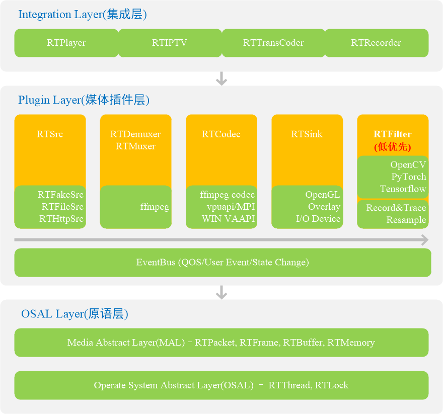

**Rockit** is a lightweight multimedia plugin system with the following features:

- Has a unified operating system adaptation layer.
- Streamlined plugin layer to minimize external dependencies; plugin layer has separate interfaces, plugins can be used alone or in tandem.
- Full-featured demultiplexing plugin, soft plugin and hard plugin.
- Support for extensions such as OpenCV plugins, Tensorflow checksums, etc.

## Architecture

## Project Files

- include: header file
- src/rt_base: base component
- src/rt_node: plugin management framework and plugin implementation
- src/rt_player: external interface
- src/rt_task: task thread and event bus
- doc: documentation
- tools: version management tool
- build/CodeBlock: CodeBlock project configuration
- build/Android: CodeBlock project configuration

## Plugin List

| Process | Plugin Name | Authors | Quality Rank\(0-5\) |  
| :---: | :--- | :---: | :---: |  
| 50% | Plugin Manager | Martin | ☆ |  
| TODO | Meta Plugin | Unkown | 0 |
| TODO | Demux Plugin  | Unkown  | 0 |  
| TODO | Muxer Plugin | Unkown | 0 |  
| TODO | Soft Plugin  | Unkown  | 0 |  
| TODO | Hard Plugin  | Unkown  | 0 |
| TODO | Filter Plugin  | Unkown  | 0 |
| TODO | IPTV Player  | Unkown  | 0 |
| TODO | Android Player  | Unkown  | 0 |

## License

[Apache License 2.0](LICENSE)
