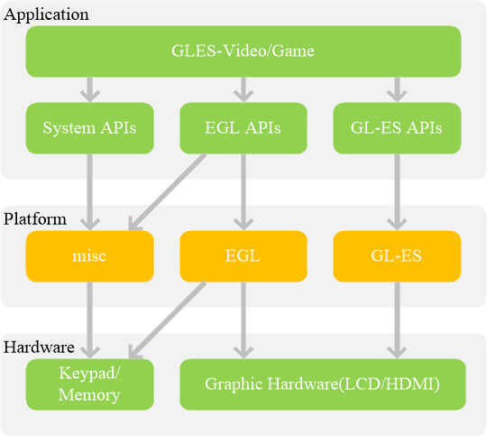

# Sink插件: GLES视频渲染

## 1 跨平台EGL接口概述

## 1.1 EGL接口简介

EGL™是Khronos渲染API（如OpenGL ES或OpenVG）与底层本机平台窗口系统之间的接口。它处理图形上下文管理，表面/缓冲区绑定和渲染同步，并使用其他Khronos API实现高性能，加速，混合模式的2D和3D渲染。EGL还提供Khronos之间的互操作能力，以实现API之间的高效数据传输 - 例如在运行OpenMAX AL的视频子系统和运行OpenGL ES的GPU之间。

更多信息，请参考：[khronos-EGL](https://www.khronos.org/registry/EGL/)

## 1.2 EGL架构

EGL是操作系统和OpenGL-ES的桥梁，操作系统具有不同的附加功能和平台特征，EGL隔离了操作系统窗口系统的差异性，保证了OpenGL-ES接口独立与操作系统。EGL聚焦于让OpenGL-ES和本地窗口系统透明的交互，而不用考虑平台窗口复杂性。OpenGL-ES本质上是图形渲染管线的状态机；EGL帮助监控OpenGL-ES的状态，维护FrameBuffer和其他Surface等外部层。EGL的系统布局图。

- EGL封装了Windows,OS-X, Linux, Android, ios的OpenGL 的 Native 接口，提供了统一管理接口。
- EGL提供了接口存储了OpenGL-ES图形渲染管线的状态
- EGL提供了接口创建、管理和销毁Frame Buffers/Surface
- EGL提供了接口对设备显示和可能的设备渲染配置的访问

### 1.2.1 Window上的EGL

Win32上的GLES和EGL仿真器有很多选择：

- Imagination Tech的PowerVR SDK中的PVRVFrame。
- ANGLE: 使用Direct3D模拟GELS/EGL。
- Mesa3D: 使用纯软件模拟GELS/EGL。
- NVidia GL驱动程序(现在包含EGL和GLES支持),需要NVidia GPU支持。
- Adreno SDK。
- ARM仿真器中的Qualcomm仿真器。

#### ANGLE项目

[Google/Angle](https://github.com/google/angle) 提供了面向Windows, Mac和Linux操作系统的OpenGL ES 2.0和EGL 1.4规范标准的实施。该项目为第三开发者在传统桌面系统上构建和运行GLES-2.0程序提供了便利。

ANGLE的目标是允许Windows用户通过将OpenGL ES API调用转换为DirectX 9或DirectX 11 API调用来无缝运行WebGL和其他OpenGL ES内容。ANGLE用作Windows平台上Google Chrome和Mozilla Firefox的默认WebGL后端。ANGLE v1.0支持OpenGL ES 2.0规范，ANGLE还提供了EGL 1.4规范的实现。

#### GLFW项目

[GLFW/glfw](https://github.com/glfw/glfw)是一个开源，跨平台的库，用于桌面上的OpenGL，Op​​enGL ES和Vulkan开发。它提供了一个简单的API，用于创建Window，Context和Surface，接收输入和事件。GLFW是用C语言编写的，并且使用X Window系统（例如Linux和FreeBSD）对Windows，macOS和许多类Unix系统提供原生支持。

## 2 通用数据结构和架构

Layer-Plugin:

- [RTNode](../src/rt_node/rt_node.h)
- [RTNodeDisplayGLES](../src/rt_node/core/rt_display_gles.h)
- [RTNodeDisplaySystem](../src/rt_node/core/rt_display_system.h)

Layer-Media:

- DisplayGLES: 使用EGL接口控制和操作具体平台的GL-ES。创建/管理和销毁GL-ES环境。(Windows/Android优先)
- DisplaySurface: 使用系统缺省的窗口系统显示视频。Android优先。
- DisplayHDMI：实现HMDI接口的相关操作接口。
- GLESVideoSprite：使用GL-ES2.0接口，实现视频纹理的相关操作接口。
- GLESVideoAnimation: 使用GL-ES2.0接口，实现简单视频动画效果。

## 3 开发计划

- 优先开发基础模块(DisplayGLES/DisplaySurface/DisplayHDMI)；
- 优先开发Android和Window的显示插件；
- Linux显示插件，有需求后续开发；
- 基础模块测试用例和显示插件测试用例。

## 参考资料

- [EGL概述 - Khronos集团公司](https://www.khronos.org/egl/)
- [Google/Angle](https://github.com/google/angle)
- [Android EGLSurfaces and OpenGL ES](https://source.android.com/devices/graphics/arch-egl-opengl)
- [SaschaWillems/openglcpp](https://github.com/SaschaWillems/openglcpp/)
- [Linux-EGL-Demo](https://blogs.igalia.com/elima/tag/egl/)
- [havenow/OpenGLES: 跨平台EGL使用demo](https://github.com/havenow/OpenGLES)
- [GLFW: Window Guide](https://www.glfw.org/docs/latest/window_guide.html)：GLFW官方的配置GLFW窗口的指南。
- [Building applications](http://www.opengl-tutorial.org/miscellaneous/building-your-own-c-application/)：提供了很多编译或链接相关的信息和一大列错误及对应的解决方案。
- [GLFW with Code::Blocks](http://wiki.codeblocks.org/index.php?title=Using_GLFW_with_Code::Blocks)：使用Code::Blocks IDE编译GLFW。
- [Running CMake](https://cmake.org/runningcmake/)：简要的介绍如何在Windows和Linux上使用CMake。
- [Writing a build system under Linux](http://learnopengl.com/demo/autotools_tutorial.txt)：Wouter Verholst写的一个autotools的教程，讲的是如何在Linux上编写构建系统，尤其是针对这些教程。
- [Polytonic/Glitter](https://github.com/Polytonic/Glitter)：一个简单的样板项目，它已经提前配置了所有相关的库；如果你想要很方便地搞到一个LearnOpenGL教程的范例工程，这也是很不错的。